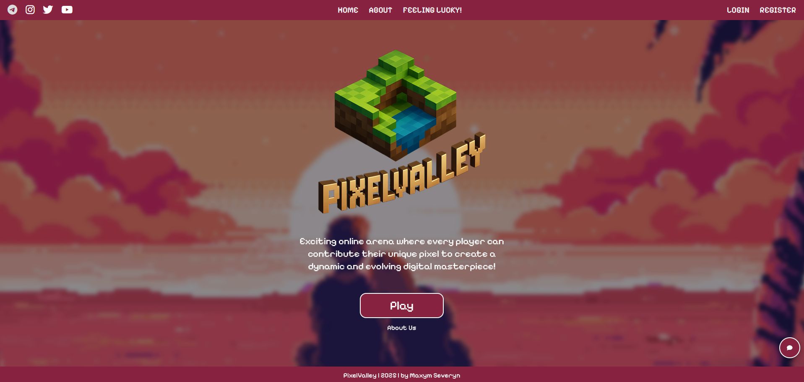
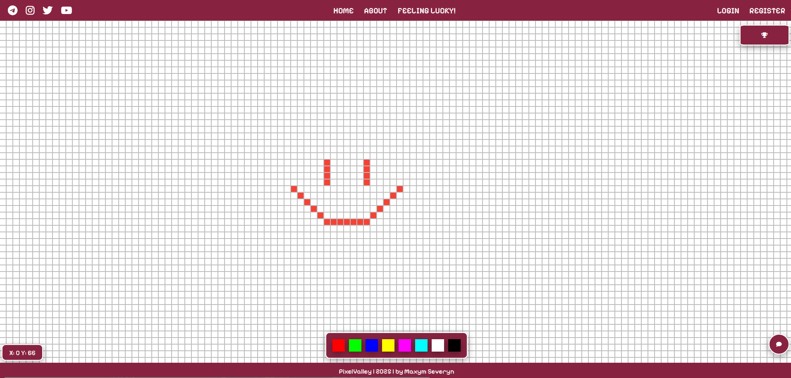

# PixelValley

Pixel art canvas where users can place pixels, choose colors, and create pixel-arts together.
Features include a color picker, leaderboard, chat.

# How to run:

1. Clone the repo
2. Run npm install
3. Run npm start
4. Open http://localhost:3000 in your browser

# Homepage:

# Canvas:

